**[Title : Process & Ingest Open Weather Map Data In DWH]{.mark}**

[Tech Stack:]{.mark}

[1.) Open Weather Map Data (API Source)]{.mark}

[2.) S3]{.mark}

[3.) Airflow]{.mark}

[4.) Glue]{.mark}

[5.) Redshift]{.mark}

[6.) CICD with AWS CodeBuild]{.mark}

[Process type: Batch]{.mark}

**Objective:**

We will be using an open API for fetching the weather data of different
cities and different countries across the globe from an API endpoint
which is hosted in any system like [Open Weather Map Data
([[https://openweathermap.org/]{.underline}](https://openweathermap.org/))
or]{.mark} VEEVA vault. We can make use of parameters (city, country)
here to call or hit the API and fetch the data through python script.

The data that we are pulling will dump into the S3 bucket. Then the glue
job will read data from S3 and after that dump data to redshift.

**Architecture diagram**

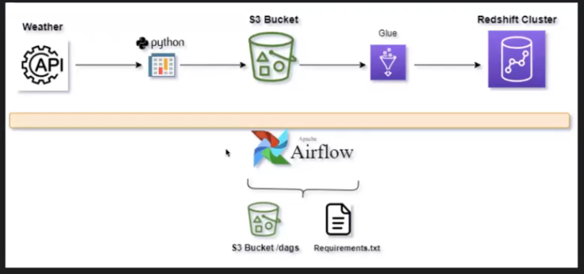{width="6.5in" height="3.0555555555555554in"}

We are not using **any crawler or glue catalog table**s here. Directly
fetching the data from hive like partition on daily bases as csv file
and applying transformation and loading it to s3.

Tips:

For incremental load or fetch only the new records, enable job bookmark
in glue job.

**Low level design:**

Airflow will have two dags where dagB is dependent on dagA. DagA will
fetch the data from source through API call and convert the json data
and write that as csv file in s3.

Once DagA completes, DagB will create a Glue job and run the glue job.
The glue job will read, transform and ingest the data into redshift.

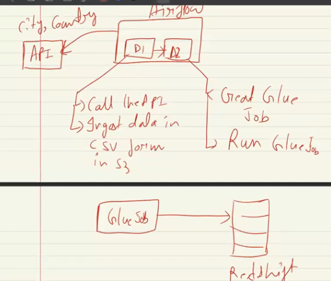{width="5.625in" height="3.588542213473316in"}

**Why do we have two different DAGS?**

Let\'s say if writing or dumping data to the redshift table and for some
reason that operation fails, does it mean fetching data from API
endpoint is also failed?

So we will separate these two operations in two separate dags and will
monitor or debug separately and execute only the failed DAG.Moving
forward any kind of backfilling or any ad-hoc run we want to perform, it
is better to separate these two.

**CICD workflow:**

Airflow dag code and glue script will get stored in S3 and this will be
used to create DAG and glue job respectively.

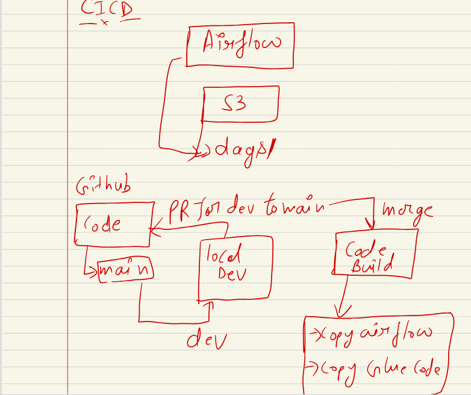{width="6.5in" height="5.458333333333333in"}

We have one main branch in Github. We will cut a new branch named dev
from main and will commit all our local code to dev. From dev we will
raise PR to merge the changes to the main branch,Once merged to main,
code build pipeline will get triggered and deploy the changes in the AWS
environment and our application will be ready to run.

Note: When we create glue via console, scripts and other details will
get stored in the s3 folder automatically after creating the s3 folder
automatically.

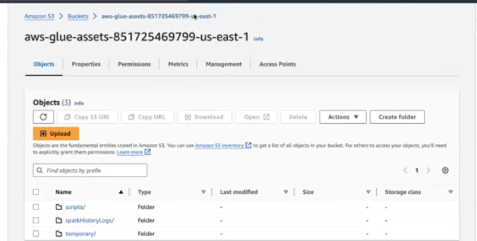{width="6.5in" height="3.2916666666666665in"}

Temporary folder, script folder and sparkHistory logs folder are created
automatically.

Here in our project, we will create an S3 folder and store the glue
scripts there and make use of those scripts to create the glue job
through the CICD pipeline. Similarly for airflow DAG as well.

**Let\'s get started with the implementation.**

**Step 1: API source account creation.**

Create an account in
[[https://openweathermap.org/]{.underline}](https://openweathermap.org/)
and get an API key. And at a later stage,since it is a very sensitive
data we will be storing this in the airflow variable. It is using this
API key in the API scripts that we will be fetching the data from this
API source.

This is how the response from the API endpoint looks like.

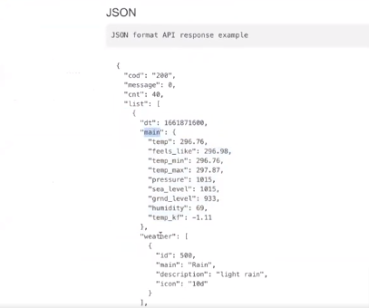{width="4.239583333333333in"
height="3.5416666666666665in"}

**Step 2:** Create a redshift connection Glue console for connecting to
the redshift.

**Step 3:** Configure and make necessary changes in the glue script and
airflow dag script that is provided.

**We haven\'t yet created any table in redshift or glue job in Aws. All
this will be done dynamically using the scripts itself.**

Code from the Glue job script weather_data_ingestion.py file that is
creating the redshift table.

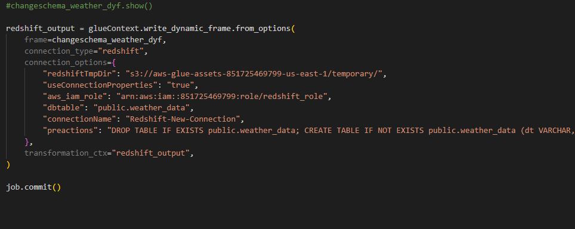{width="6.5in" height="2.5833333333333335in"}

Code from the airflow DAG script in transform_redshift_load.py file that
is creating the glue job and this glue job will contain the code from
the above image or file name weather_data_ingestion.py. You can see in
the below image we are mentioning the above code path in the script
location while creating the glue job through airflow dag code.
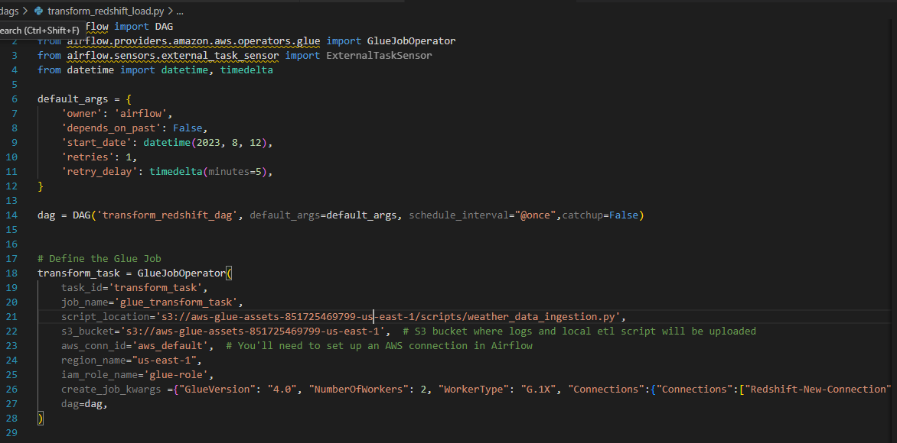{width="6.5in" height="3.2222222222222223in"}

**Step 4:** Build a codebuild to perform CICD

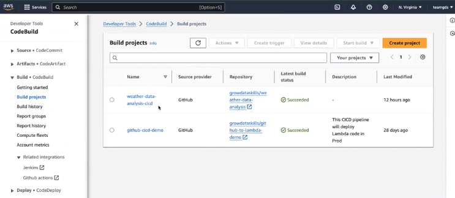{width="6.5in" height="2.8333333333333335in"}

**Step 5**: Commit all files to github and raise a PR to main from dev,
so that our codebuild will get started and run the buildspec.yaml file
and copy the DAG and glue scripts to corresponding S3 locations.

Once we merged the PR build was getting started.

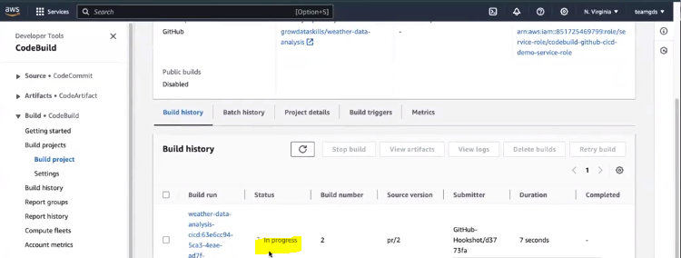{width="6.5in" height="2.4583333333333335in"}

**Step 6 :** Create Airflow environment

Follow the steps in this video to set up Amazon Managed Workflows for
Apache Airflow.\
\
Don\'t forget to add the requirement.txt file s3 path that we copied
using buildspec.yaml while setting up the airflow.

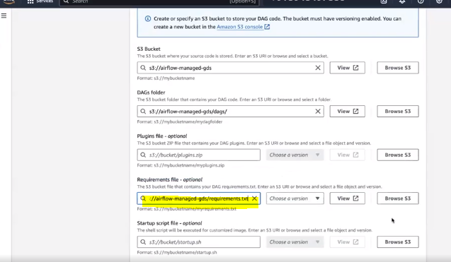{width="6.5in" height="3.7916666666666665in"}

Enable the public network and configure the security group,VPC and
subnets accordingly.

The path that you are mentioning for DAGS should be the same as the one
you are using in buildspec.yaml file, where you are copying the DAG
script.

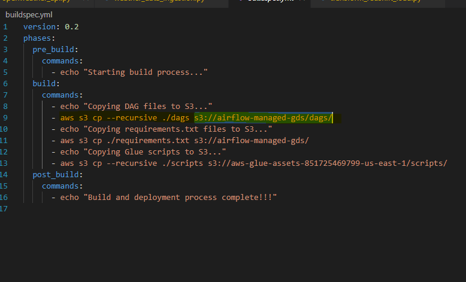{width="6.5in" height="2.7443186789151355in"}

Airflow DAGS get created

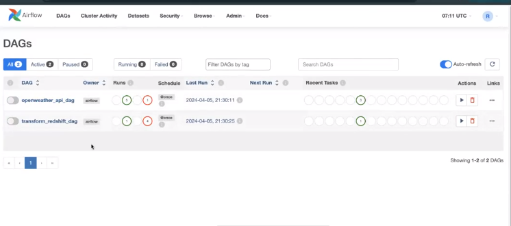{width="6.5in" height="2.875in"}

Now configure the API security key and AWS default conn that we are
using in the scripts of getting connected to API endpoint and AWS
respectively.

Now enable the DAG. We have scheduled the DAG to run at midnight 12 AM
(schedule_interval=\"@once\").For now we can manually trigger the DAG.

The First DAG ran successfully, it fetched the data from source,
uploaded the data to S3 in csv format and triggered the next dependent
DAG.

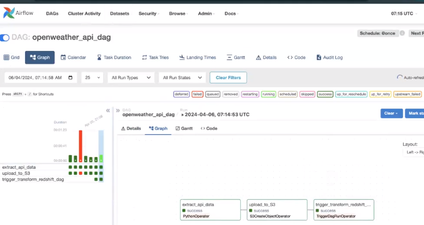{width="6.5in" height="3.4444444444444446in"}

Now our second DAG also gets triggered and the transform task(Create and
execute glue job) is running now.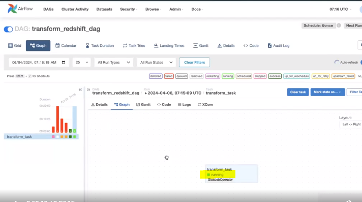{width="6.5in"
height="3.625in"}

A new glue job (glue_transfrom_task) is created and it is running.

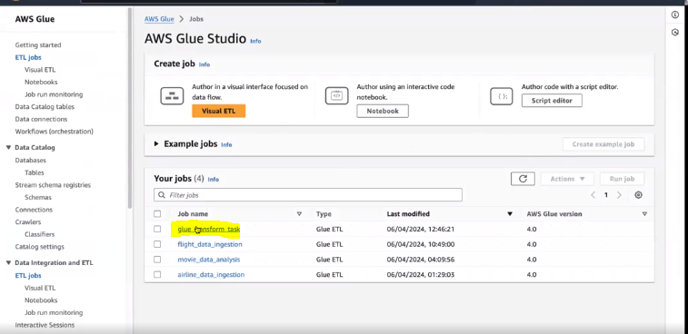{width="6.5in" height="3.1666666666666665in"}

Finally data is loaded into the redshift table as we wanted.

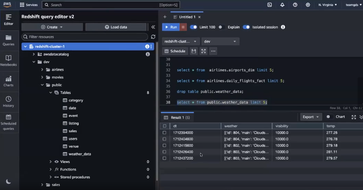{width="6.5in" height="3.388888888888889in"}
